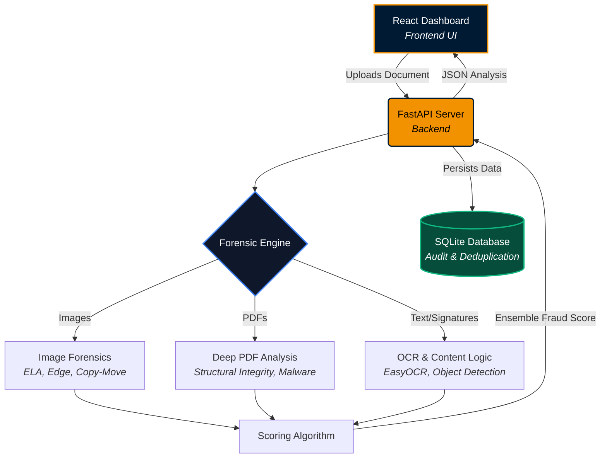

# Kanara Bank Intelligence: Document Forensics

A real-time, AI-driven document authentication and fraud detection system designed for banking associates. It analyzes uploaded documents (both digital PDFs and scanned images) using deep forensic techniques to instantly detect tampering, forgery, and malicious payloads.

## 🏗️ Architecture



## ✨ Key Features

- **Multi-Modal Forensics**: Runs Error Level Analysis (ELA), edge detection, and copy-move forgery detection on images to find spliced pixels.
- **Deep PDF Inspection**: Scans for embedded malware (e.g. URI payload links), incremental update manipulation (`%%EOF` markers), and suspicious PDF editor metadata.
- **Smart Deduplication**: Instantly flags re-uploaded documents by matching SHA-256 hashes to prevent processing duplicate fraud attempts.
- **Associate-First UI**: Features an enterprise dashboard with visual heatmaps, detailed metric breakdowns, and a strict "Hard-Fail" critical error screen.

## 🚀 Getting Started

1. **Start the application**:
   Run the included startup script from the project root:
   ```powershell
   .\start.ps1
   ```
   *(This script will automatically install dependencies, start the backend on port 8000, and launch the React frontend).*

2. **See it in Action (Testing)**:
   Use the included script to generate a highly-malicious PDF payload for testing:
   ```powershell
   cd backend
   python create_malicious_pdf.py
   ```
   Upload the generated `malicious_test_doc.pdf` to the dashboard to watch the system instantly intercept the payload, tank the score to 0, and trigger a critical rejection!

---
*Built for the Kanara Bank Fraud Intelligence Team.*
# Intelligent Banking Document Fraud Detection System

This repository contains the full-stack implementation of the Canara Bank Hackathon project. The system uses a FastAPI backend with Python-based forensic modules (EasyOCR, OpenCV, PyPDF2) and a maximalist, atmospheric React frontend.

## 🚀 Running the Application Locally
.\start.ps1
